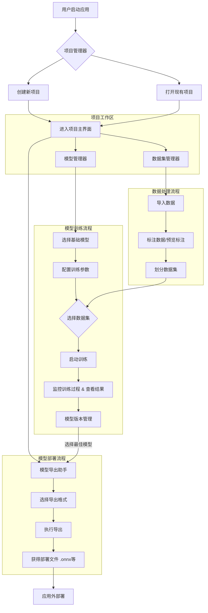
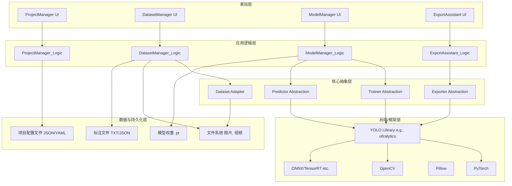
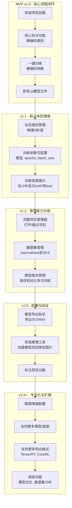

# YOLOFlow

做一个YOLO项目的工作流，平台选用Python+Pytorch，界面使用PySide6进行实现，yolo相关的继承的合并到可选模块中.

开发计划：项目管理>导入数据>标注数据>预览标注>模型选取>模型训练>版本管理>模型导出，这些界面功能都需要自己实现

训练模型和标注数据分开成两个部分，完成ProjectManager、DatasetManager、ModelManager、ExportAssistant，这四个分开的界面

不打算与YOLO进行深度绑定，要对YOLO框架进行一些抽象，将训练器进行二次实现。

## 架构推进

要求一次只完成一个任务，每一个任务应充分考虑到之后任务的衔接性，界面库选用PySide6，不需要额外追求美观，先实现功能，后期再进行美化。

不要完成没有指定的事情，这样会极大的增加开发负担，你只需要每一步只关注一小部分实现，并做好就可以了。

`test`目录下存放测试用代码，文件以`test_`开头，测试代码中可以使用`pytest`进行测试。源代码保存在`src/yoloflow`目录下。该项目使用`uv`进行项目管理，你所用的命令行基于真实环境而不是项目环境，所以如果需要增加软件包，使用`uv add 包名`进行添加，如果需要执行该程序，应使用`uv run yoloflow`，或者在执行的指令前添加`.venv/Scripts/activate &`，当你需要使用python时应调用`uv run python`。

不要写多余的文档，优先在聊天中输出，我会结合你的输出整理到README.md中。

项目的开发要求是以库的形式开发，你应尽可能的模块化，并区分功能的将代码安排在不同的子模块中（我已经预先帮你创建好了`yoloflow/cli`、`yoloflow/ui`、`yoloflow/service`这三个子模块，如果你有新的需求，请自己创建对应的模块目录），除此之外，你还需自己安排这些模块的__init__.py文件，确保每个模块都能被正确且最短的导入。

现在你的任务是：

**开始屏幕 Splash Screen**

开始屏用于在预加载Python库（比如PyTorch）时显示，不至于让用户什么也看不到，开始屏幕应展示一张无边框的图片，同时在图片左下角用黑底白字叠加显示加载流程信息，并在右下角显示版本号，在加载完成后如果距离开始展示开始平面的时间小于2秒，则等待至2秒后再打开项目管理器窗口。

**项目管理器 ProjectManager**

开始界面变成之前先实现项目管理器类（**ProjectManager**）和项目类（**Project**），同时用sqlite3在运行目录下创建一个数据库文件`yoloflow.db`用于存放项目记录，项目记录包含项目名称、项目路径、创建时间、最后打开时间等信息。要求项目以文件夹的形式组织，其中包含`yoloflow.toml`用于存放项目上下文信息，包含`dataset`文件夹用于存放数据集，包含`model`文件夹用于存放每个版本的权重文件，包含`pretrain`文件夹用于存放预训练权重，包含`runs`文件夹用于存放每次训练的日志和结果（由ultralytics等引擎生成）。项目类通过指定项目文件夹并读取下面的信息完成初始化，后续对于项目的操作都需要依赖这个类的实例，而针对项目更加详细的设置则交给项目配置文件`yoloflow.toml`来管理，同样为这个配置添加一个辅助类（**ProjectConfig**）用于快速配置信息，如都有哪些数据集、都保存了哪些模型、用户当前选定的模型、当前指定的数据集、模型保存的历史记录、用户设定的训练参数（这部分需要提供一个额外字段的管理办法，将这些字段通过字符串进行保存，以备将来用户直接在界面修改）。

1. 主界面

让我们一步一步的开展工具，项目管理器的作用是创建新项目，打开已有项目，管理最近项目。

2. 创建新项目

项目类型同Ultralytics，包含图像分类、目标检测、语义分割、实例分割、关键点跟踪以及旋转检测框这些任务类别，当选择项目模板指定项目路径后，自动向项目管理器添加关于这个项目的记录，并初始化项目

## 程序运行框图

## 程序架构图

## 路线图

