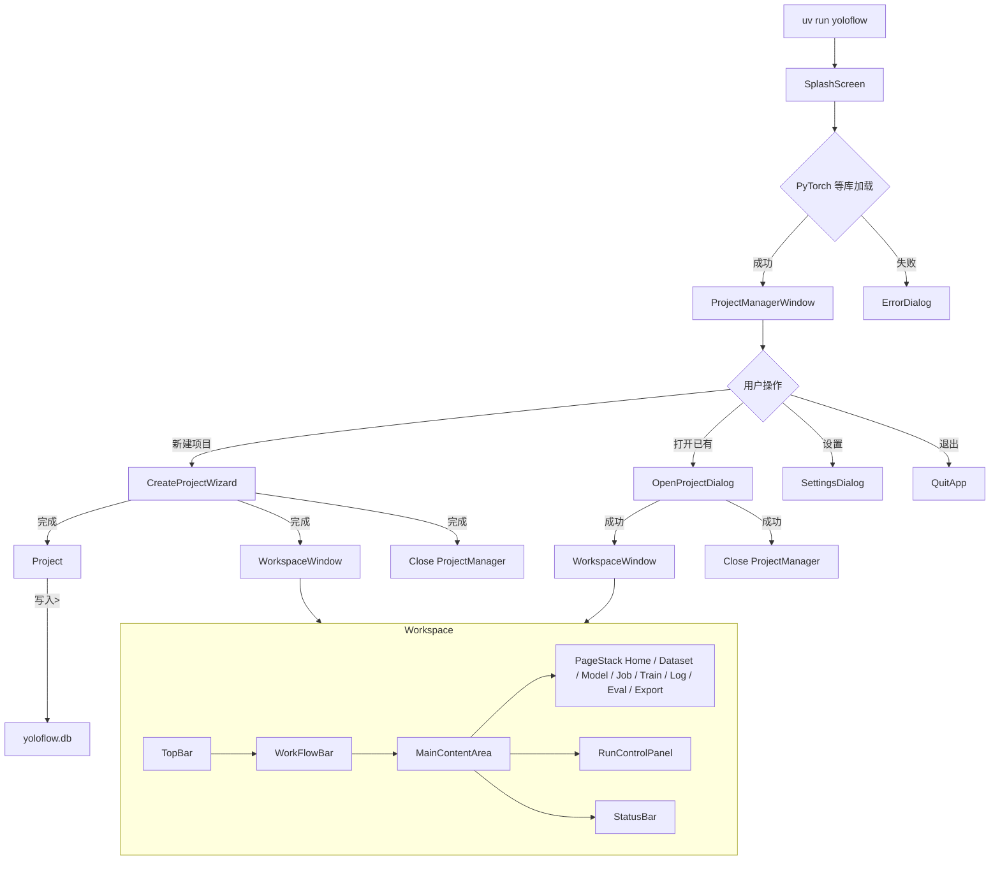
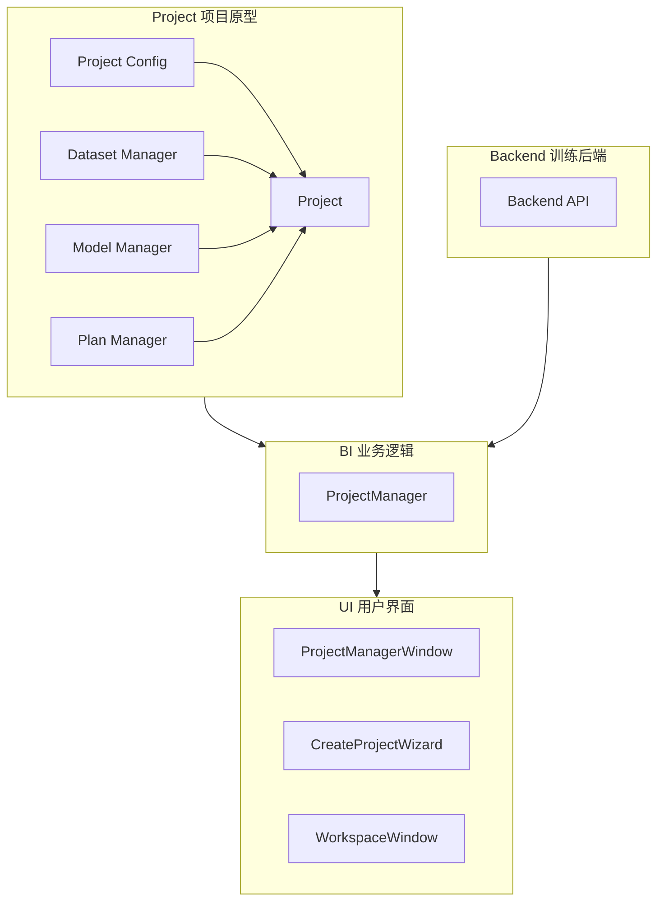
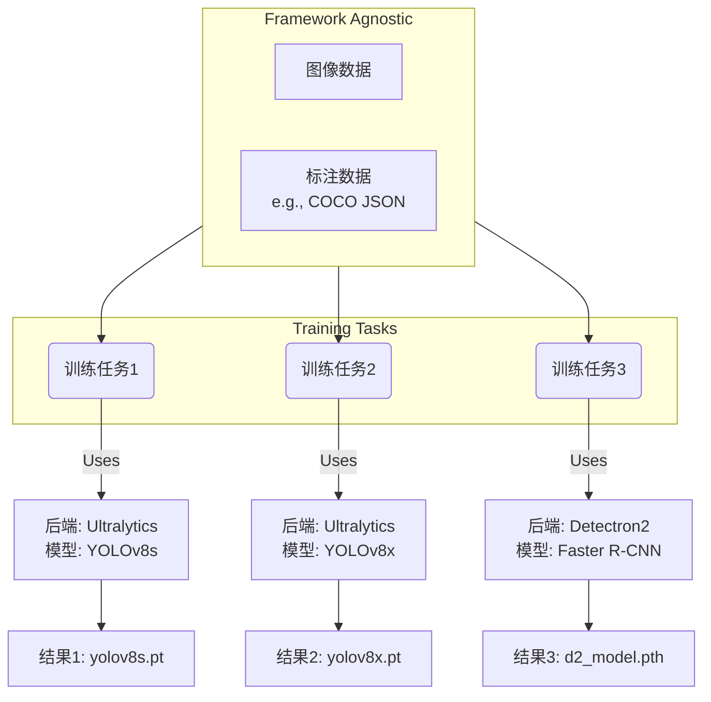

# YOLOFlow

做一个YOLO项目的工作流，平台选用Python+Pytorch，界面使用PySide6进行实现，yolo相关的继承的合并到可选模块中.

开发计划：项目管理>导入数据>标注数据>预览标注>模型选取>模型训练>版本管理>模型导出，这些界面功能都需要自己实现

训练模型和标注数据分开成两个部分，完成ProjectManager、DatasetManager、ModelManager、ExportAssistant，这四个分开的界面

不打算与YOLO进行深度绑定，要对YOLO框架进行一些抽象，将训练器进行二次实现。

## 架构推进

要求一次只完成一个任务，每一个任务应充分考虑到之后任务的衔接性，界面库选用PySide6，不需要额外追求美观，先实现功能，后期再进行美化。

不要完成没有指定的事情，这样会极大的增加开发负担，你只需要每一步只关注一小部分实现，并做好就可以了。

`test`目录下存放测试用代码，文件以`test_`开头，测试代码中可以使用`pytest`进行测试。源代码保存在`src/yoloflow`目录下。

该项目使用`uv`进行项目管理，你所用的命令行基于真实环境而不是项目环境，所以如果需要增加软件包，使用`uv add 包名`进行添加，如果需要执行该程序，应使用`uv run yoloflow`，或者在执行的指令前添加`.venv/Scripts/activate &`，当你需要使用python时应调用`uv run python`，当你需要运行测试时执行`uv run pytest`。

不要写多余的文档，优先在聊天中输出，我会结合你的输出整理到README.md中。

项目的开发要求是以库的形式开发，你应尽可能的模块化，并区分功能的将代码安排在不同的子模块中（我已经预先帮你创建好了`yoloflow/cli`、`yoloflow/ui`、`yoloflow/service`这三个子模块，如果你有新的需求，请自己创建对应的模块目录），除此之外，你还需自己安排这些模块的__init__.py文件，确保每个模块都能被正确且最短的导入。

由于pyproject.toml中已经指定了`src`目录为源代码目录，所以你导入模块时应直接使用`import yoloflow`而不是`import src.yoloflow`。

现在你的任务是：

**开始屏幕 Splash Screen**

开始屏用于在预加载Python库（比如PyTorch）时显示，不至于让用户什么也看不到，开始屏幕应展示一张无边框的图片，同时在图片左下角用黑底白字叠加显示加载流程信息，并在右下角显示版本号，在加载完成后如果距离开始展示开始平面的时间小于2秒，则等待至2秒后再打开项目管理器窗口。

**项目管理器 ProjectManager**

开始界面变成之前先实现项目管理器类（**ProjectManager**）和项目类（**Project**），同时用sqlite3在运行目录下创建一个数据库文件`yoloflow.db`用于存放项目记录，项目记录包含项目名称、项目路径、创建时间、最后打开时间等信息。要求项目以文件夹的形式组织，其中包含`yoloflow.toml`用于存放项目上下文信息，包含`dataset`文件夹用于存放数据集，包含`model`文件夹用于存放每个版本的权重文件，包含`pretrain`文件夹用于存放预训练权重，包含`runs`文件夹用于存放每次训练的日志和结果（由ultralytics等引擎生成）。项目类通过指定项目文件夹并读取下面的信息完成初始化，后续对于项目的操作都需要依赖这个类的实例，而针对项目更加详细的设置则交给项目配置文件`yoloflow.toml`来管理，同样为这个配置添加一个辅助类（**ProjectConfig**）用于快速配置信息，如都有哪些数据集、都保存了哪些模型、用户当前选定的模型、当前指定的数据集、模型保存的历史记录、用户设定的训练参数（这部分需要提供一个额外字段的管理办法，将这些字段通过字符串进行保存，以备将来用户直接在界面修改）。

**项目管理器 主界面**

项目管理器在开始屏幕关闭后打开，其作用是创建新项目，打开已有项目，管理最近项目。依然保留之前的无边框设计，做一个简单是二分栏界面，左边是三个按钮，从上往下依次是：创建新项目、打开已有项目、设置。右侧是一个列表，显示最近打开的项目，点击列表中的项目可以打开该项目，列表项应展示项目名称、项目位置和最后打开时间。

项目管理器主界面顶部需自己实现一个标题栏，包含应用名称和版本号，右上角有一个关闭按钮，点击后关闭应用。项目管理器应采用深色背景，白色背景和深色的开始屏幕相比对比度太高，此外项目管理器界面上三个按钮的大小有点过大，可以考虑压缩左栏的空间，最后，你需要为每个项目的列表项增加鼠标扫过的效果。

为所有的按钮添加鼠标悬停改变指针的效果，确保用户可以知道按钮是可以被按下的，此外添加删除项目的功能，点击项目列表项右侧的删除按钮可以删除该项目记录，并且弹出一个窗口询问用户是否要将对应的项目目录也删除。如果可以的话，为按钮这些按钮添加icon图标，前面提到的删除按钮就仅显示图标。此外修改顶部标题栏中关闭按钮的样式，将其从圆形改为方形，宽高比为4：3。然后你还需修复一个项目标题字显示不全的问题，增加项目名称的行高。

**项目管理器 删除**

为项目删除添加独立的界面，要求界面的样式保持与项目管理器一致，且复用项目管理器的标题栏，删除界面的内容应展示提示信息（是否要删除这个项目）、项目名称、描述、路径、创建日期、最后打开时间等信息，包含一个选项框用于选择是否删除项目目录，以及删除（红色）、取消（灰色），点击删除后根据用户的选择直接删除对应项目，无需弹出二次确认对话框。

除此之外，将project_manager_window中用到的组件抽取出来，以保障以后的复用

**在能够创建项目之前还需做的事情**

通过项目创建助手创建项目需要能够:

仿照项目设置类创建项目数据集类用于管理数据集信息，也就是项目目录下的`dataset`文件夹，该管理类应当作为由项目类实例化的一个属性存在，且依赖项目设置类，项目数据集信息包含数据集名称，数据集路径（项目中的采用相对路径），数据集类型，数据集描述，需要实现数据集的添加、删除和基本的修改功能，同时当导入数据集时能根据导入文件的类型，自动决定导入的方法，如当导入文件夹时，自动将文件夹复制到项目目录下的`dataset`目录，当导入zip文件时，自动解压，两种添加方法都应在项目配置文件中记录数据集的名称和路径。由于无法判断数据集的具体类型，如果没有指定，默认以项目类型为准。

模型选择项中，是创建项目助手所使用的过程类，包含一个模型选择器，当输入任务类型后，应给出可以使用的模型列表，此外我还需要对模型列表进行抽象，模型类可以给出：模型名称、模型文件名、参数量、适用任务类型、描述信息。所有的模型都需要在模型选择项类中的大列表中进行注册才能在配置项返回的查询结果中给予展示。

任务信息类需要包含任务类型、任务名称、任务描述、示例图片等信息，任务类型需要是一个枚举类，现已经定义。现需要定义一个供之后页面选择任务类型的数据提供者类（TaskTypeProvider），以上任务信息类需要注册之后才能被提供，注意：该类仅在创建项目助手阶段发挥作用，之后将依赖于单纯的任务类型枚举。

项目模型管理器（ProjectModelManager）用于管理项目中的每一个模型，项目中包含两种模型：预训练模型（存储在`pretrain`文件夹中）和训练过的模型（存储在`model`文件夹中），用户可以随时创建一个训练计划并得到一个匹配的训练过的模型，用户可以随时添加预训练模型，只要模型的任务类型与当前项目的任务类型匹配，针对每一个添加的训练计划都应该存储一个上下文信息（PlanContext）在项目的`model`文件夹中，和模型放在一起，该训练计划由用户命名，计划上下文包含用户设定的训练参数（核心是纪元数、学习率、输入图像大小，其他存字典）、验证参数（置信度阈值、IoU阈值）、预训练模型位置、训练结果模型（最佳模型、最新模型）、数据集信息（可以采用多个数据集、单独设置每个数据集的目标，训练集测试集验证集还是混合，混合即采用数据集内部设定），训练计划应当以toml存储在`model/<uuid>.toml`，同时创建一个项目计划管理器（ProjectPlanManager）管理每一个计划。

在上一步创建了项目模型管理器和项目计划管理器，但是这两个管理器并不是作为项目类的一个属性存在的，这导致加载项目需要额外再加载这两个管理器，请确保这两个管理器能够被正确的随项目类加载并依赖项目设置类，而且创建项目计划的方法居然在项目模型管理器内，而项目计划管理器并不作为项目类的属性，你需要修复这个问题。该问题已修复

**创建新项目**

创建项目向导窗口符合Tab布局，tab栏在左侧，依次包含项目类型、项目信息（名称、描述、路径）、数据集配置、模型配置选项。项目类型页面，以多行多列展示TaskTypeProvider中提供的项目类型，以确定项目的TaskType。在项目信息页面，用户可以输入项目名称、描述和路径，路径可以通过浏览按钮选择。数据集配置采用表格形式组织，包含表头的添加和每个表项的删除，为数据集添加增加一个单独的窗口，用于填写DatasetInfo中的每一个字段。以下一步和Tab选项组织各个页面的转换，当进行到最后一步时下一步改为创建按钮，点击后创建项目并打开项目，创建项目的过程应在实际点击创建项目之后开始，所以你需要写一个视图模型和创建任务的清单，在点击创建项目后才执行这个清单，并在项目管理器中添加该项目记录。

项目创建向导被内嵌在项目管理页面中，这是错误的，应该让项目创建向导作为一个单独的窗口显示。

CreateProjectWizard还有最后一个问题没有解决：当你使用tab栏切换页面时，下方的下一步和上一步会失去其作用，你这么修改，上一步和下一步随着页面变动动态切换状态，直到最后一页创建的时候，如果不能创建（前面有关键的部分没有填写），则显示为灰色

在创建项目时有可能会有下载模型的需求，请创建一个模型创建信息提示框，包含自定义标题栏，信息栏和进度条，并通过回调函数等链接到initialize_project中

我发现一些更加严重的问题：首先，项目设置中不应该包含模型训练的超参数，这部分设置应该是由项目计划存储的；其次，项目设置对应模型的管理应当进行优化，需要创建一个项目基本的模型信息类ProjectModelInfo，保存模型的名称、描述、参数量、任务类型、文件名、以及来源（由项目创建、由计划创建，存储字符串）；再然后，添加模型部分再添加模型和预训练模型后都应该添加到available列表中，供计划选择，还应将current字段删除，现在使用项目计划来管理训练任务；最后，项目设置中同样需要保存计划相关的信息，可以创建一个plan_info类存储计划的基本信息（计划名称、计划文件位置），还有就是目前计划文件放在model目录下，这个目录应该是放置计划的输出文件的，请修改项目类创建plan目录保存那些计划文件

项目计划并没有被添加到项目根配置文件中，请检查一下是helper函数的问题还是项目计划管理器的问题，并修复

**工作区 Workspace**

接下来的任务十分的复杂，你需要整体考量。

工作区是用户进行项目开发和管理的主要区域，包含主页、数据集、模型、作业、训练、日志、评估、导出八大功能、其中作业和训练需要使用额外的逻辑来驱动项目数据模型，也是yoloflow最核心的功能。

工作区是典型的上下式布局，从上往下分别是顶栏（三段式水平布局固定高度，包含菜单栏、标题、窗口控制（放大缩小关闭））、工作流栏（两段式水平布局固定高度，包含主页、数据集、模型、作业、训练、日志、评估、导出这八个Tab项居左，以及运行计划控件（选择计划、运行、暂停、终止）居右）、主窗口（不限制布局，填充剩余高度，负责显示工作流栏中每一个具体项目的Frame）、状态栏（两段式水平布局固定高度，包含文本信息居左，和进度条（两个）、页面控制（缩放调整）居右）总计四栏。整体设计风格应当使用深色背景，浅色或白色字体，整个工作区应当能够适用不同的桌面大小（并非响应式设计，目标设备在4:3~16:9之间，分辨率短边至少720）。需要重新设计窗口的标题栏以实现复杂的三段式设计，其中窗口控制按钮宽高比4:3高度要占满并居右，项目名称文本居中，菜单栏局左，如果屏幕比较小，菜单栏应当可以将标题栏向右挤压直到碰到窗口控制按钮，此时开始将多出的字缩略显示。菜单栏主要包含项目（新建项目、打开项目、项目管理器|保存、另存为|退出）、运行（运行当前选中、暂停、终止、跳转到作业页面）、窗口（包含八个窗口的每一个）、帮助（文档、协议、关于）

当项目管理器通过各种渠道（新建、最近项目、打开已有）打开项目时，应当关闭自身，并打开工作区窗口作为新的活动窗口，工作区窗口不应该有任何父窗口，工作区窗口需要有项目管理器的实例和打开项目的实例。

完成以上项目，将每个子页面创建一个空白页放置在`ui/pages`中，组件放置在`ui/components`中，页面窗口放置在`ui`中。在这一阶段，你不需要编写任何业务代码，仅需创建UI结构，你仅需将传入的项目实例和项目管理器的实例传递到根部组件即可。

从这一步开始我们遵循先做界面再做页面的原则，可以优先保障想法的实现。

**数据集页面 Datasets Page**

数据集页面，包含对数据集宏观的查看、删除、导入导出、管理，而关于数据集的创建、标注、预览需要完成对数据集的抽象后才能继续进行。所以创建和打开某份具体的数据集需要保存一个空白页，这个页面需要叠加显示在数据集页面上，只有一个返回按钮返回到数据集页面，除此之外暂时只展示当前打开/创建的数据集名称。整个数据集页面应该按照以下规则进行布局：

1. 数据集页面需要上下两栏布局，上面是一个数据集页面的工具栏，下面是数据集项目
2. 工具栏采用左右布局，左边是创建、导入、导出，右边是筛选、多选和搜索框
3. 数据集项目以响应式网格布局进行排版，其中每一个数据集都是其中的一个项目
4. 数据集项目采用卡片式设计，卡片包含上下两部分，上面是数据集中任意的一张图片（原型阶段没有业务类可以使用空），下面是数据集的名称、描述、类型，点击卡片即可打开数据集详情，除此之外，每个卡片包含一个右键菜单
5. 数据集项目的右键菜单包含以下选项：查看详情、导出、设置、删除

这个网格容器和滚动区域存在一些问题：
首先滚动区域应该限制只能上下滚动，宽度正好填充，内部不应该再提供宽度上的自由度，因为应用程序的界面大小可以变化
其次网格容器在限制宽度的滚动容器内，应随着最大宽度的变化而改变列数，同时也能缩放其中的卡片使其正好填充宽度

**模型页面 Model Page**

模型页面，包含对模型的查看、管理、导入导出等功能，实际的数据需要等到业务类的实现才能给到，所以优先使用mock数据，而模型页面的布局与数据集页面类似，按照以下规则进行布局：

1. 模型页面分为上下两栏布局，上面是一个模型页面的工具栏，下面是模型项目
2. 工具栏采用左右布局，左边是新增、导入、导出，右边是筛选、多选和搜索框
3. 模型项目采用垂直列表布局，列表中需要带有分类信息，比如在一个大列表中有三个个小列表分别是预训练、训练过的模型、导入的模型，在这种情形下优先展示预训练模型
4. 每个模型数据卡片包含模型的基本信息，如名称、描述、类型、参数量等，点击卡片即可打开模型详情查看模型的来源和评价，除此之外，每个卡片包含一个右键菜单
5. 模型项目的右键菜单包含以下选项：查看详情、导出、创建训练计划、删除

**作业页面 Job Page**

作业页面展示的是项目内的计划，包含计划的新增、删除、编辑等功能，以及对每一个计划内部采用模型、数据集、训练参数、验证参数的设置，是yoloflow的核心所在，现阶段尚未实现业务逻辑，优先使用mock数据。作业页面按照以下规则进行布局：

1. 采用两段式水平布局，左边比较窄的一列是计划列表，右边是计划详情区域
2. 计划列表采用垂直列表布局，包含计划名称、描述、状态等信息，点击计划可以查看详情，同时表头提供一个添加计划按钮，表项提供一个删除计划按钮
3. 计划详情区域采用表单形式从上往下展示，从上往下依次是计划名称（标题栏，不可修改）、基础信息（在这里修改名称、任务类型（优先继承自项目），除了修改外还展示创建日期和修改日期）、预训练模型选择（单选，可以选择任意一个同类任务类型的模型）、数据集选择（多选，可以添加任意多的数据集并自由决定数据集如何组成更大的数据集，见DatasetTarget，展示一个列表项，拥有添加删除按钮和每项的单独设置）、训练参数（纪元、初始学习率、图像输入大小、批次大小、以及一个toml片段编辑框组成的额外训练参数设置）、验证参数（置信度阈值、IoU阈值）

**业务模块 BI Models**

由于继续推进训练页面会导致产生不可控的复杂性，所以我们需要先实现业务逻辑。

我的计划是使得yoloflow支持自定义后端，比如ultralytics、detectron2等，甚至可以支持自定义的模型训练器,那么这些后端一定不能通过模块的方式直接引入。调度训练器的方案需要结合多方面的需求进行讨论，我已经想到的可行方案有：命令行调用、REST API、WebSocket、gRPC等，其中命令行调用可以最快实现，可以优先考虑，这会引入uv作为环境管理工具。

业务模块是典型的控制器架构，即yoloflow是MVC架构设计，而通过以上的形式可以确保依赖倒置，这样就不会掣肘于某个具体的框架。

TODO：属于yoloflow的命令行启动参数，当指定项目时直接启动工作室，当为指定时启动项目管理器，而启动工作室前才需要加载splash screen。

**后端系统 Backend System**

后端系统负责对不同的训练框架进行抽象（如Ultralytics、Detectron2等），提供统一的接口和调用方式。后端系统的逻辑满足以下要求：

1. 所有后端文件存储在工作目录下的`backends`文件夹中，其中每一个后端都应该是一个uv项目，同时在根目录层级也是yoloflow的一个模块。
2. 假如我们有一个ultralytics模块，其存放在`backends/ultralytics`目录下，在这个模块文件夹下至少包含：`src`目录用于存放yoloflow具体某个后端的执行逻辑、`pyproject.toml`定义后端模块的依赖和项目结构、`__init__.py`用于将该目录标记为一个Python包供yoloflow上位机引用。
3. `__init__.py`中通过继承BackendBase类来定义后端模块的基本信息，并导出一个YoloflowBackendModule(BackendBase)类供后端系统引入
4. BackendManager类用于管理所有后端模块，提供加载、安装、卸载、查询这些主要功能，还提供整个后端系统支持的任务类型和提供的模型，采用BackendInfo作为管理时的核心类，同时需要把基本信息在解析完每个模块后同步到`backends`目录下对应同名的toml文件中（如`backends/ultralytics.toml`）。BackendManager在初始化的时候不要进行模块的加载，而是通过方法在外部加载，支持获取待加载列表一个一个加载。同时支持安装依赖功能，你需要在单独的线程中初始化虚拟环境、执行前处理函数、执行指令以调用uv安装依赖、执行后处理函数，并捕获异常来判断依赖是否安装成功。

## 程序运行框图

## 架构图

## 后端训练逻辑

