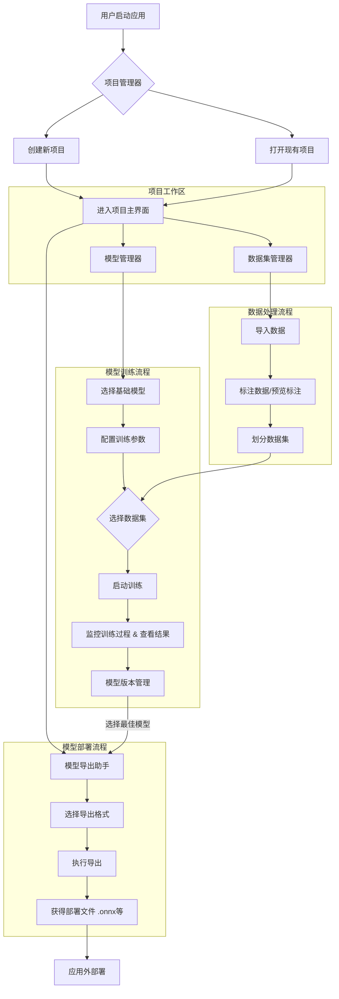
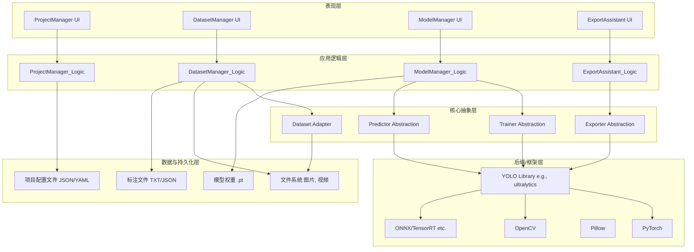
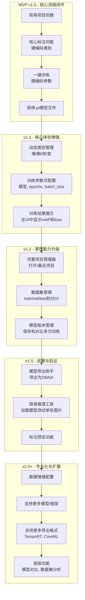

# YOLOFlow

做一个YOLO项目的工作流，平台选用Python+Pytorch，界面使用PySide6进行实现，yolo相关的继承的合并到可选模块中.

开发计划：项目管理>导入数据>标注数据>预览标注>模型选取>模型训练>版本管理>模型导出，这些界面功能都需要自己实现

训练模型和标注数据分开成两个部分，完成ProjectManager、DatasetManager、ModelManager、ExportAssistant，这四个分开的界面

不打算与YOLO进行深度绑定，要对YOLO框架进行一些抽象，将训练器进行二次实现。

## 架构推进

要求一次只完成一个任务，每一个任务应充分考虑到之后任务的衔接性，界面库选用PySide6，不需要额外追求美观，先实现功能，后期再进行美化。

不要完成没有指定的事情，这样会极大的增加开发负担，你只需要每一步只关注一小部分实现，并做好就可以了。

`test`目录下存放测试用代码，文件以`test_`开头，测试代码中可以使用`pytest`进行测试。源代码保存在`src/yoloflow`目录下。该项目使用`uv`进行项目管理，你所用的命令行基于真实环境而不是项目环境，所以如果需要增加软件包，使用`uv add 包名`进行添加，如果需要执行该程序，应使用`uv run yoloflow`，或者在执行的指令前添加`.venv/Scripts/activate &`，当你需要使用python时应调用`uv run python`，当你需要运行测试时执行`uv run pytest`。

不要写多余的文档，优先在聊天中输出，我会结合你的输出整理到README.md中。

项目的开发要求是以库的形式开发，你应尽可能的模块化，并区分功能的将代码安排在不同的子模块中（我已经预先帮你创建好了`yoloflow/cli`、`yoloflow/ui`、`yoloflow/service`这三个子模块，如果你有新的需求，请自己创建对应的模块目录），除此之外，你还需自己安排这些模块的__init__.py文件，确保每个模块都能被正确且最短的导入。

由于pyproject.toml中已经指定了`src`目录为源代码目录，所以你导入模块时应直接使用`import yoloflow`而不是`import src.yoloflow`。

现在你的任务是：

**开始屏幕 Splash Screen**

开始屏用于在预加载Python库（比如PyTorch）时显示，不至于让用户什么也看不到，开始屏幕应展示一张无边框的图片，同时在图片左下角用黑底白字叠加显示加载流程信息，并在右下角显示版本号，在加载完成后如果距离开始展示开始平面的时间小于2秒，则等待至2秒后再打开项目管理器窗口。

**项目管理器 ProjectManager**

开始界面变成之前先实现项目管理器类（**ProjectManager**）和项目类（**Project**），同时用sqlite3在运行目录下创建一个数据库文件`yoloflow.db`用于存放项目记录，项目记录包含项目名称、项目路径、创建时间、最后打开时间等信息。要求项目以文件夹的形式组织，其中包含`yoloflow.toml`用于存放项目上下文信息，包含`dataset`文件夹用于存放数据集，包含`model`文件夹用于存放每个版本的权重文件，包含`pretrain`文件夹用于存放预训练权重，包含`runs`文件夹用于存放每次训练的日志和结果（由ultralytics等引擎生成）。项目类通过指定项目文件夹并读取下面的信息完成初始化，后续对于项目的操作都需要依赖这个类的实例，而针对项目更加详细的设置则交给项目配置文件`yoloflow.toml`来管理，同样为这个配置添加一个辅助类（**ProjectConfig**）用于快速配置信息，如都有哪些数据集、都保存了哪些模型、用户当前选定的模型、当前指定的数据集、模型保存的历史记录、用户设定的训练参数（这部分需要提供一个额外字段的管理办法，将这些字段通过字符串进行保存，以备将来用户直接在界面修改）。

1. 项目管理器 主界面

项目管理器在开始屏幕关闭后打开，其作用是创建新项目，打开已有项目，管理最近项目。依然保留之前的无边框设计，做一个简单是二分栏界面，左边是三个按钮，从上往下依次是：创建新项目、打开已有项目、设置。右侧是一个列表，显示最近打开的项目，点击列表中的项目可以打开该项目，列表项应展示项目名称、项目位置和最后打开时间。

项目管理器主界面顶部需自己实现一个标题栏，包含应用名称和版本号，右上角有一个关闭按钮，点击后关闭应用。项目管理器应采用深色背景，白色背景和深色的开始屏幕相比对比度太高，此外项目管理器界面上三个按钮的大小有点过大，可以考虑压缩左栏的空间，最后，你需要为每个项目的列表项增加鼠标扫过的效果。

为所有的按钮添加鼠标悬停改变指针的效果，确保用户可以知道按钮是可以被按下的，此外添加删除项目的功能，点击项目列表项右侧的删除按钮可以删除该项目记录，并且弹出一个窗口询问用户是否要将对应的项目目录也删除。如果可以的话，为按钮这些按钮添加icon图标，前面提到的删除按钮就仅显示图标。此外修改顶部标题栏中关闭按钮的样式，将其从圆形改为方形，宽高比为4：3。然后你还需修复一个项目标题字显示不全的问题，增加项目名称的行高。

2. 项目管理器 删除

为项目删除添加独立的界面，要求界面的样式保持与项目管理器一致，且复用项目管理器的标题栏，删除界面的内容应展示提示信息（是否要删除这个项目）、项目名称、描述、路径、创建日期、最后打开时间等信息，包含一个选项框用于选择是否删除项目目录，以及删除（红色）、取消（灰色），点击删除后根据用户的选择直接删除对应项目，无需弹出二次确认对话框。

除此之外，将project_manager_window中用到的组件抽取出来，以保障以后的复用

3. 在能够创建项目之前还需做的事情

通过项目创建助手创建项目需要能够:

仿照项目设置类创建项目数据集类用于管理数据集信息，也就是项目目录下的`dataset`文件夹，该管理类应当作为由项目类实例化的一个属性存在，且依赖项目设置类，项目数据集信息包含数据集名称，数据集路径（项目中的采用相对路径），数据集类型，数据集描述，需要实现数据集的添加、删除和基本的修改功能，同时当导入数据集时能根据导入文件的类型，自动决定导入的方法，如当导入文件夹时，自动将文件夹复制到项目目录下的`dataset`目录，当导入zip文件时，自动解压，两种添加方法都应在项目配置文件中记录数据集的名称和路径。由于无法判断数据集的具体类型，如果没有指定，默认以项目类型为准。

模型选择项中，是创建项目助手所使用的过程类，包含一个模型选择器，当输入任务类型后，应给出可以使用的模型列表，此外我还需要对模型列表进行抽象，模型类可以给出：模型名称、模型文件名、参数量、适用任务类型、描述信息。所有的模型都需要在模型选择项类中的大列表中进行注册才能在配置项返回的查询结果中给予展示。

任务信息类需要包含任务类型、任务名称、任务描述、示例图片等信息，任务类型需要是一个枚举类，现已经定义。现需要定义一个供之后页面选择任务类型的数据提供者类（TaskTypeProvider），以上任务信息类需要注册之后才能被提供，注意：该类仅在创建项目助手阶段发挥作用，之后将依赖于单纯的任务类型枚举。

项目模型管理器（ProjectModelManager）用于管理项目中的每一个模型，项目中包含两种模型：预训练模型（存储在`pretrain`文件夹中）和训练过的模型（存储在`model`文件夹中），用户可以随时创建一个训练计划并得到一个匹配的训练过的模型，用户可以随时添加预训练模型，只要模型的任务类型与当前项目的任务类型匹配，针对每一个添加的训练计划都应该存储一个上下文信息（PlanContext）在项目的`model`文件夹中，和模型放在一起，该训练计划由用户命名，计划上下文包含用户设定的训练参数（核心是纪元数、学习率、输入图像大小，其他存字典）、验证参数（置信度阈值、IoU阈值）、预训练模型位置、训练结果模型（最佳模型、最新模型）、数据集信息（可以采用多个数据集、单独设置每个数据集的目标，训练集测试集验证集还是混合，混合即采用数据集内部设定），训练计划应当以toml存储在`model/<uuid>.toml`，同时创建一个项目计划管理器（ProjectPlanManager）管理每一个计划。

<!-- TODO: 模型选择项、模型配置项、训练历史记录、训练完成的模型列表 -->

在上一步创建了项目模型管理器和项目计划管理器，但是这两个管理器并不是作为项目类的一个属性存在的，这导致加载项目需要额外再加载这两个管理器，请确保这两个管理器能够被正确的随项目类加载并依赖项目设置类

4. 创建新项目

创建项目向导窗口符合Tab布局，tab栏在左侧，依次包含项目类型、项目信息（名称、描述、路径）、数据集配置、模型配置选项。项目类型页面，以多行多列展示TaskTypeProvider中提供的项目类型，以确定项目的TaskType。在项目信息页面，用户可以输入项目名称、描述和路径，路径可以通过浏览按钮选择。数据集配置采用表格形式组织，包含表头的添加和每个表项的删除，为数据集添加增加一个单独的窗口，用于填写DatasetInfo中的每一个字段。以下一步和Tab选项组织各个页面的转换，当进行到最后一步时下一步改为创建按钮，点击后创建项目并打开项目，创建项目的过程应在实际点击创建项目之后开始，所以你需要写一个视图模型和创建任务的清单，在点击创建项目后才执行这个清单，并在项目管理器中添加该项目记录。

## 程序运行框图

## 程序架构图

## 路线图

